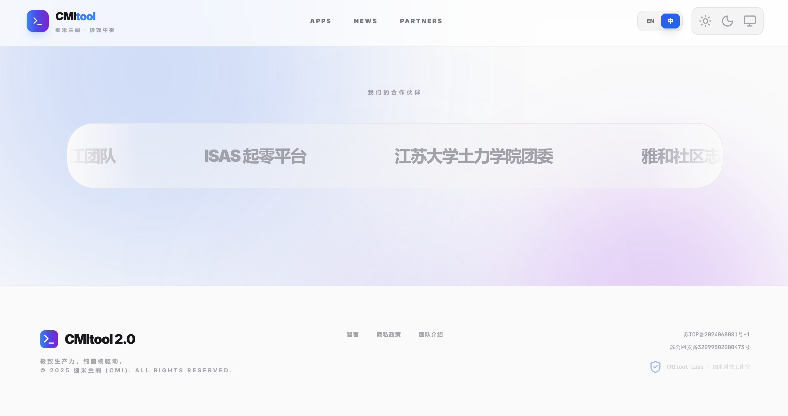
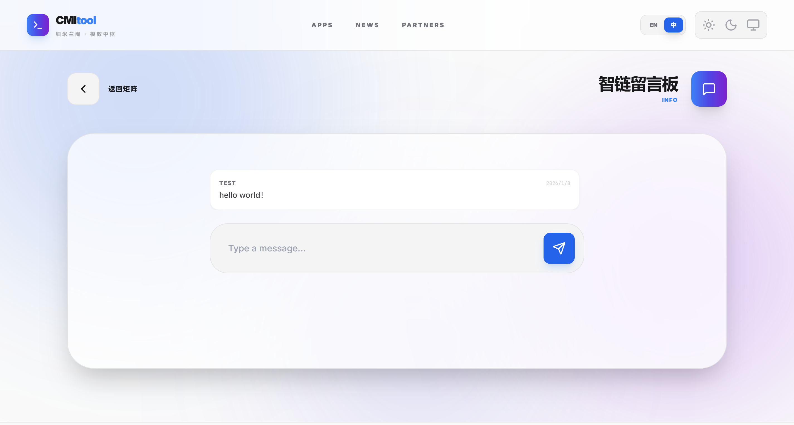
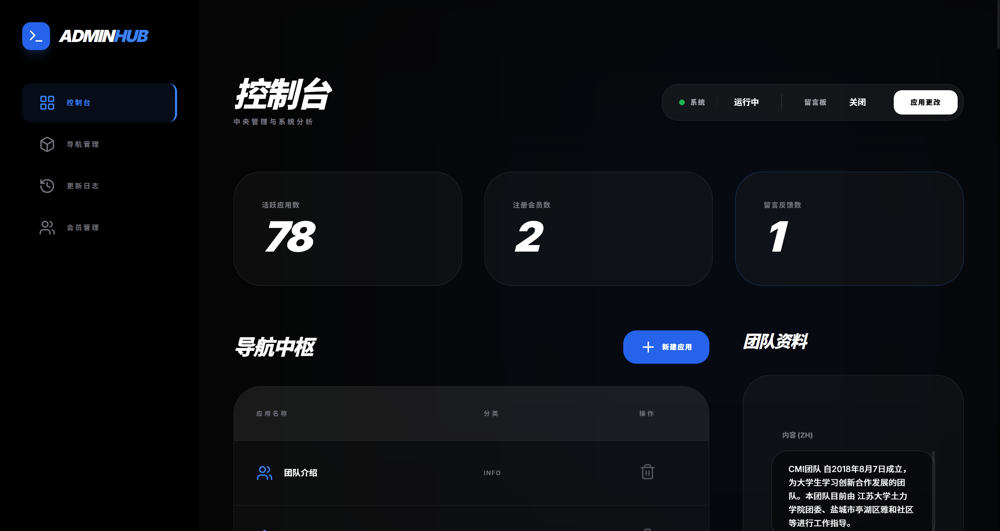

# Ultra-Simple-LNMP-Architecture-Navigation-Hub
# CMItool 2.0 - Similan Intelligent Hub (细米兰阁中枢导航)

<p align="center">
  <a href="http://testfile.cmiteam.top" target="_blank">
    
  </a>
</p>

<p align="center">
  
  
  
  
  
</p>

[English](#english) | [中文](#chinese)

---

<a name="english"></a>
## 🇬🇧 English

### Introduction
**CMItool 2.0** (Similan Intelligent Hub) is a lightweight, aesthetically modern web navigation portal and toolbox.
**🔗 Live Demo**: [http://testfile.cmiteam.top](http://testfile.cmiteam.top)

> [!NOTE]
> This project is designed to be privacy-first. Most tools run entirely in your browser.

### ✨ Key Features
- **🎨 Modern UI**: Glassmorphism design, dark mode support, and smooth animations.
- **🛠 Local Tools**: Privacy-first browser-based tools (Quantum Clock, JSON Formatter, etc.).
- **🌍 Bilingual**: English & Chinese support.
- **🔐 Secure Auth**: Role-based access control (Admin/User).
- ** Responsive**: Mobile-first design.

### 📸 Screenshots




### 📂 File Structure
```
cmitool/
├── api/                   # Backend API Endpoints
│   ├── main.php           # Core data fetcher
│   └── messages.php       # Message board handler
├── assets/                # Frontend Assets
│   ├── css/               # Tailwind & Custom styles
│   └── js/                # App logic (app.js, tools.js)
├── includes/              # Configuration & Helpers
│   └── db.php             # Database connection
├── admin_dashboard.php    # Admin Control Panel
├── index.php              # Main Landing Page
├── login.php              # Login Page
├── register.php           # Registration Page
├── install.sql            # Database Schema
└── maintenance.php        # Maintenance Mode Page
```

### 🛠 Technology Stack
- **Frontend**: HTML5, Vanilla JavaScript, Tailwind CSS.
- **Backend**: PHP 7.4+ (Native).
- **Database**: MySQL 5.7+.

### 🚀 Installation & Deployment
*(See Chinese section for detailed guide)*
1. Clone repo.
2. Import `install.sql`.
3. Configure `includes/db.php`.
4. Deploy.

### License
[MIT](LICENSE)

---

<a name="chinese"></a>
## 🇨🇳 中文 (Chinese)

### 项目简介
**CMItool 2.0** (细米兰阁中枢导航) 是一个专为大学生和极客设计的轻量级、高颜值 Web 导航与工具箱平台。
**🔗 在线演示**: [http://testfile.cmiteam.top](http://testfile.cmiteam.top)

### ✨ 核心功能
- **🎨 现代设计**: 玻璃拟态风格，完美适配深色模式。
- **🛠 本地工具**: 量子时钟、JSON 格式化等纯前端工具。
- **🌍 双语支持**: 中/英一键切换。
- **🔐 权限管理**: 完备的用户/管理员系统。

###  目录结构
```
cmitool/
├── api/                   # 后端 API 接口
│   ├── main.php           # 核心数据获取
│   └── messages.php       # 留言板处理
├── assets/                # 前端资源
│   ├── css/               # 样式文件
│   └── js/                # 核心逻辑 (app.js, tools.js)
├── includes/              # 配置与助手函数
│   └── db.php             # 数据库连接
├── admin_dashboard.php    # 管理员后台
├── index.php              # 首页
├── login.php              # 登录页
├── register.php           # 注册页
├── install.sql            # 数据库安装文件
└── maintenance.php        # 维护模式页面
```

### 🛠 技术栈
- **前端**: HTML5, 原生 JavaScript, Tailwind CSS.
- **后端**: PHP 7.4+ (无框架).
- **数据库**: MySQL 5.7+.

### 🚀 部署指南

1.  **获取代码**
    ```bash
    git clone https://github.com/cmijohnson/Ultra-Simple-LNMP-Architecture-Navigation-Hub.git
    cd Ultra-Simple-LNMP-Architecture-Navigation-Hub
    ```

2.  **数据库配置**
    - 创建数据库 `cmitool`。
    - 导入 `install.sql`。
    - *默认管理员*: `admin` / `admin123`

3.  **连接配置**
    - 修改 `includes/db.php` 填入数据库信息。

4.  **启动**
    - 上传至服务器根目录即可。

### 🤝 参与贡献
欢迎 Pull Request！

### 开源协议
[MIT](LICENSE)

---

## Star History

[](https://star-history.com/#cmijohnson/Ultra-Simple-LNMP-Architecture-Navigation-Hub&Date)


